# Feature 
## Most of feature is support on MacOs
## New 

  #### Clean architecture with cubit
   * [ReadMore](./doc/clean_architecture.md)
   
  | Support Fold name  | Image                                           |
  |---------------|-------------------------------------------------|
  | **features** | 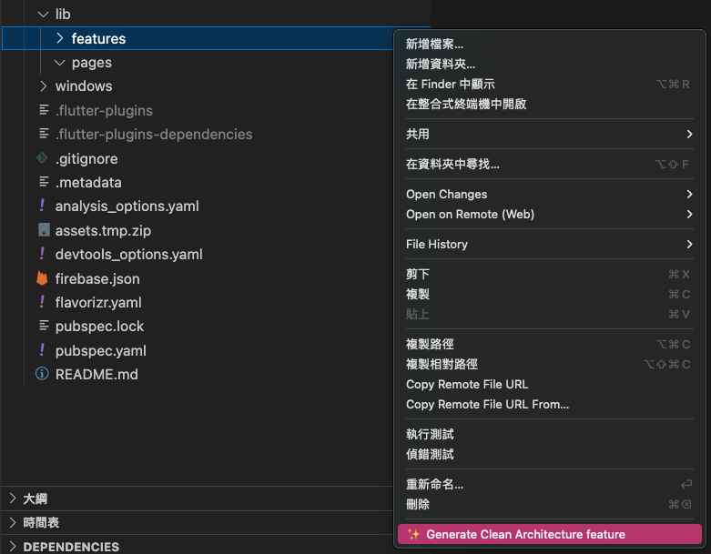    |
  | **pages** | 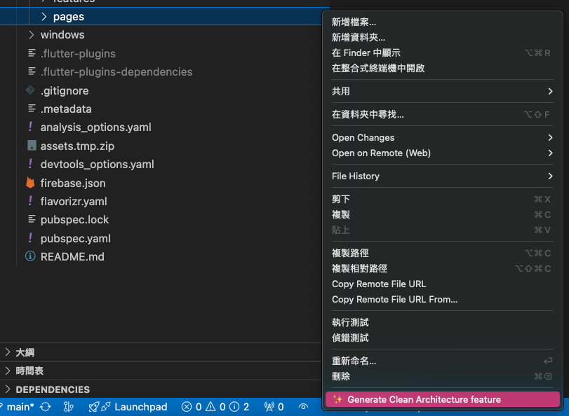    |
  | **File tree** | 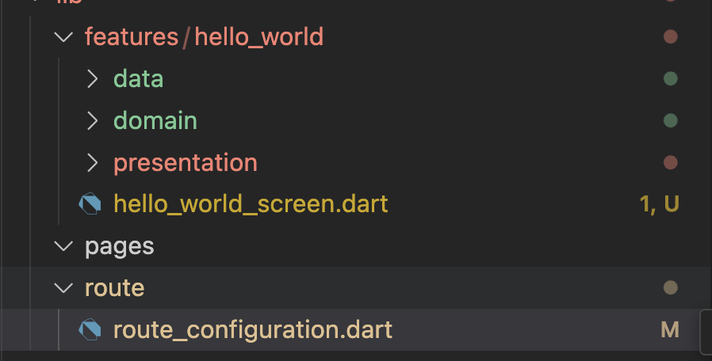       |
  
  | Feature | Image                                           |
  |---------------|-------------------------------------------------|
  | **Add cubit** | 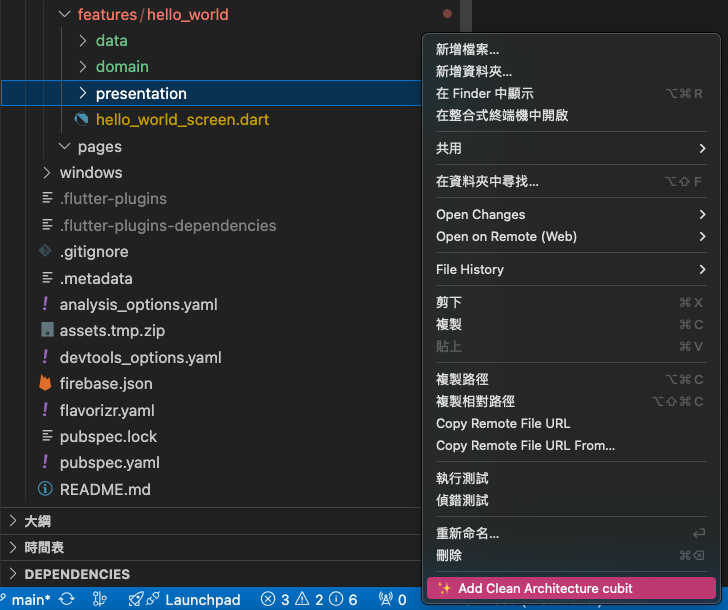    |
  | **Register Route** | 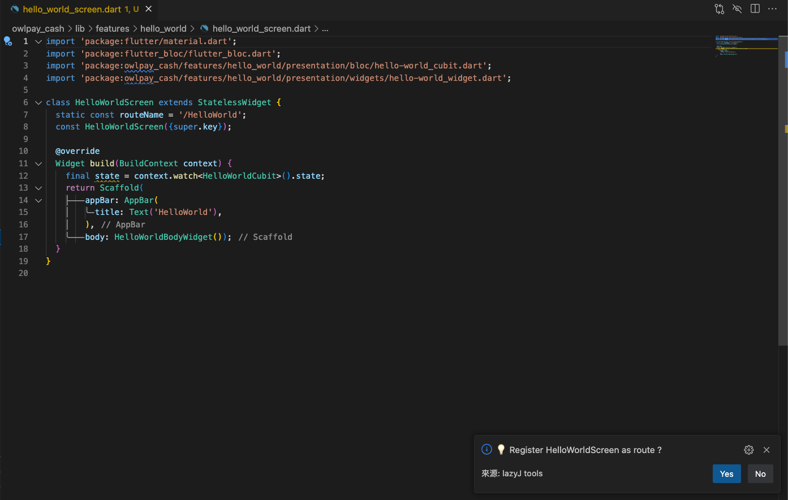    |


  #### Dart Asset Transformer
  * [ReadMore](./doc/assets_creator.md)
 
 | Support Fold name  | Image                                           |
 |---------------|-------------------------------------------------|
 | **images** | 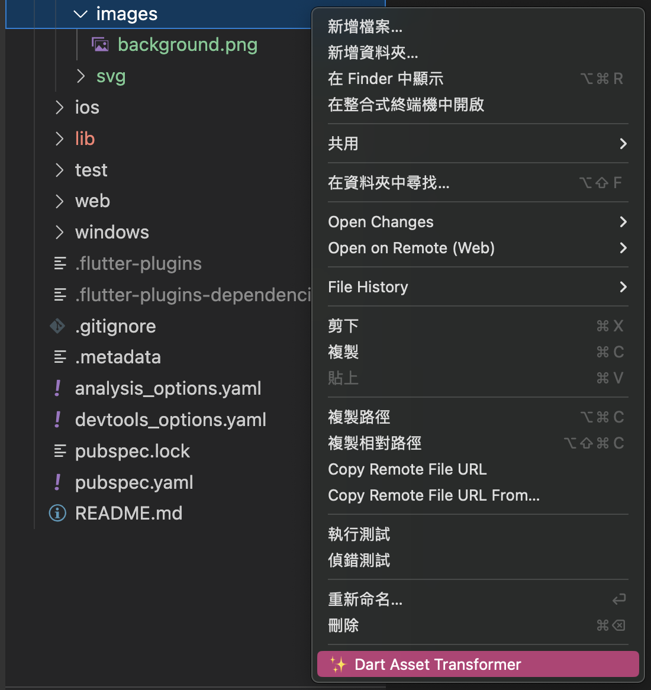    |
 | **svg** | 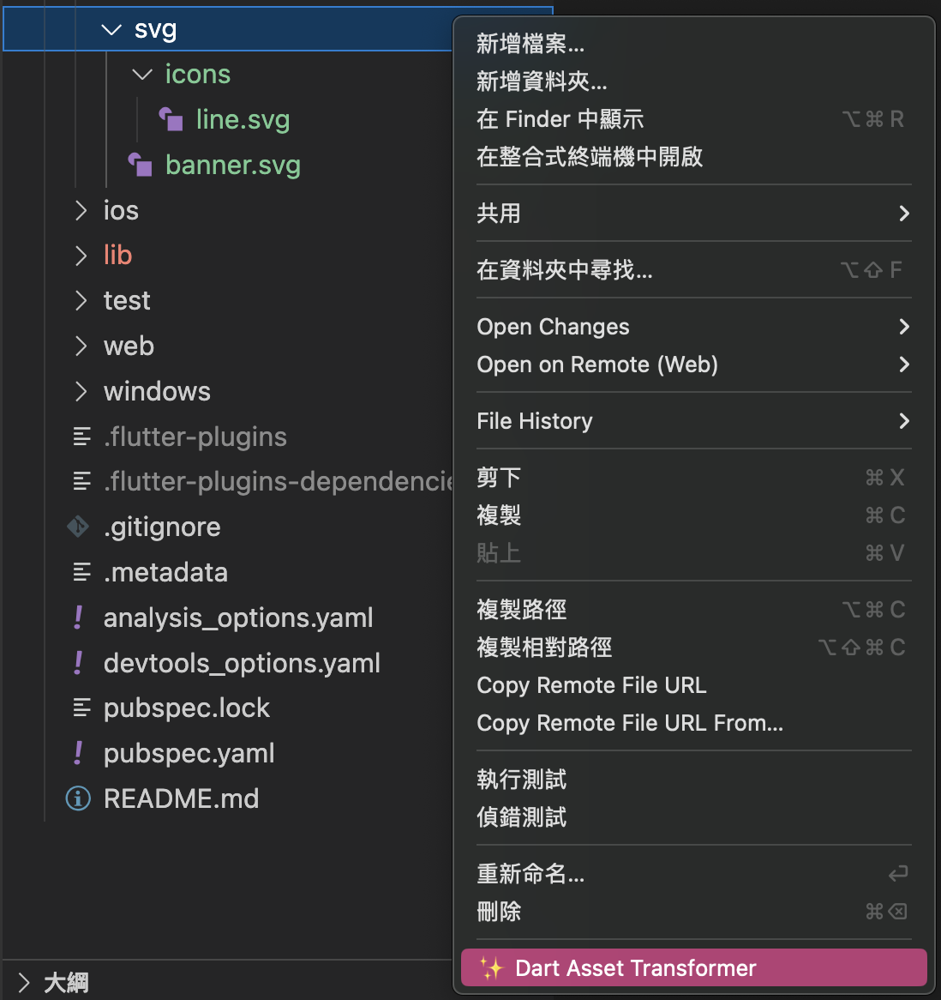    |
 | **File Tree** | 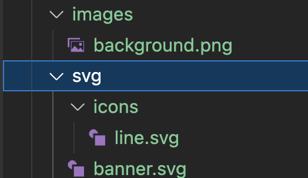       |
 | **File Tree** | lib/asserts 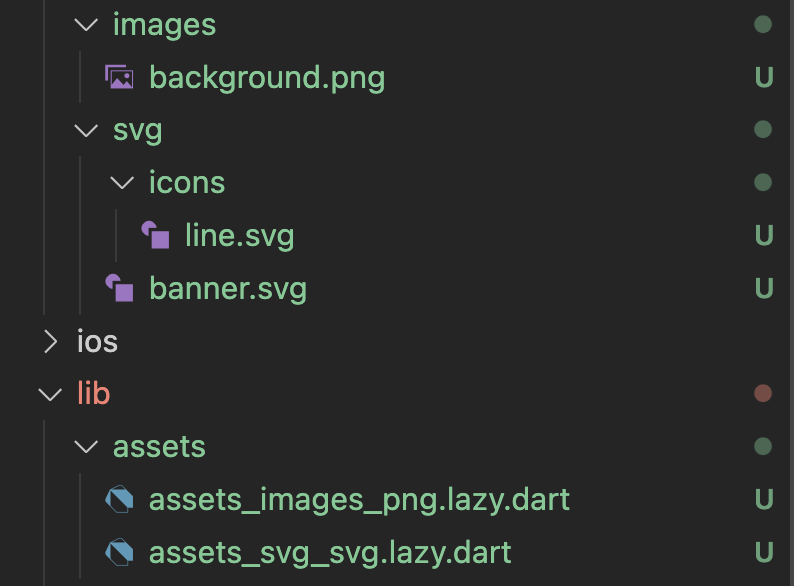    
 
 

  - Generate Clean Architecture folder only show menu when right-click when folder name is 'features'


  * [Vscode extension flutter logger easy life](https://marketplace.visualstudio.com/items?itemName=jackFan.lazy-jack-flutter-logger-easy-life)

  * without extension
  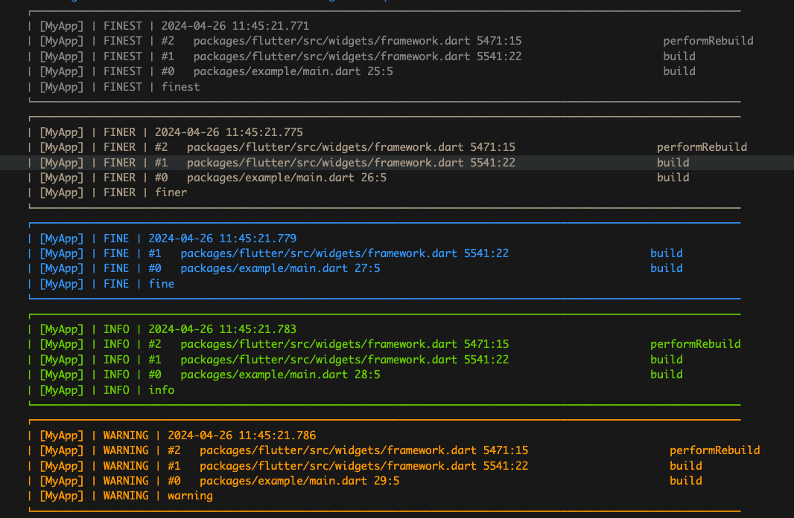
  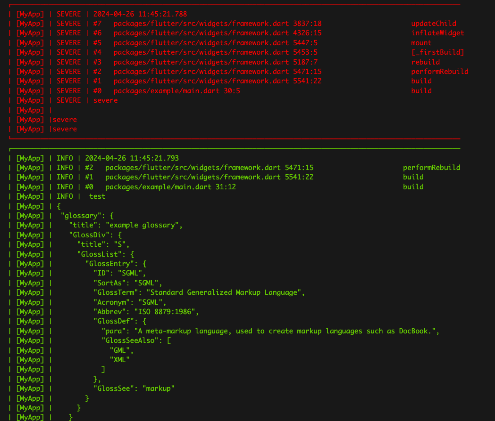

  * with extension you can tap absolute path to code line position
  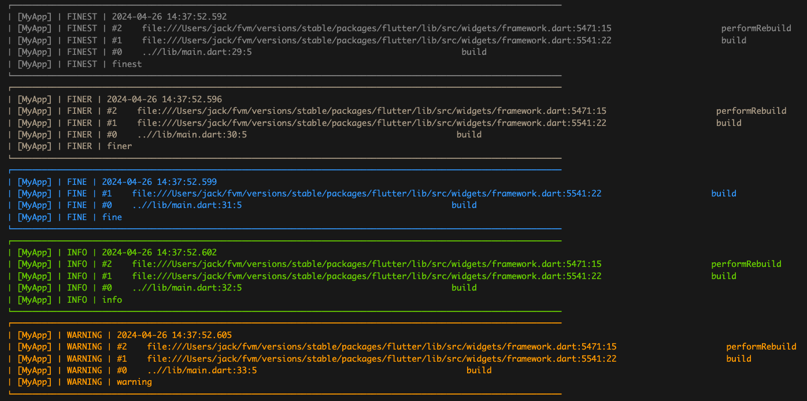
  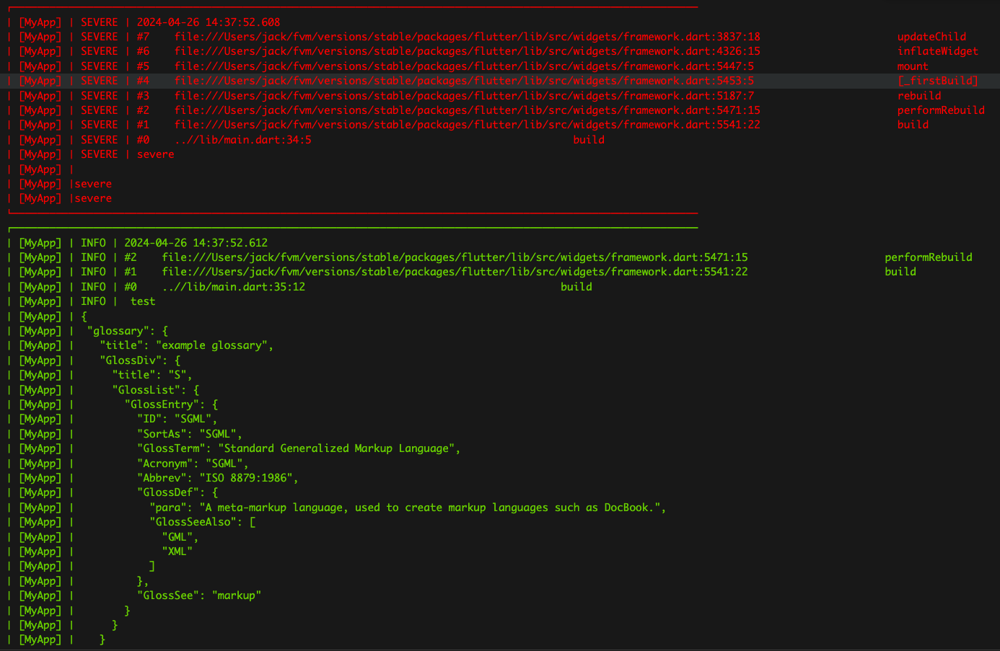


## Old feature


  * String format (onSelected)
  
    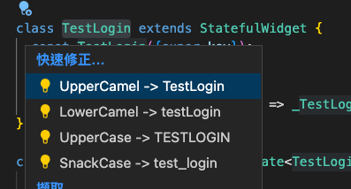
  * Freezed quick fix

    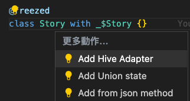
  * Extract class to file

    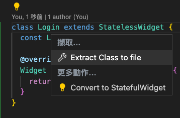

#### freezed 
  * Create freezed

    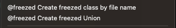


#### Json to freezed

  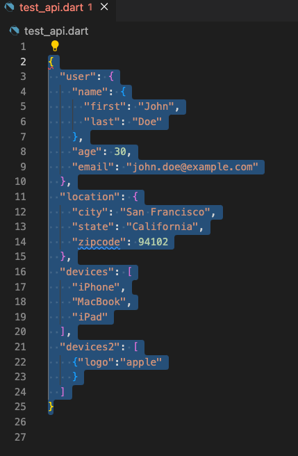
  
  * Menu

    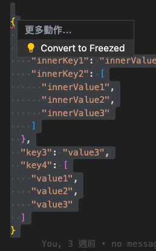

  * Convert to freezed Result
    ```dart 
    import 'package:freezed_annotation/freezed_annotation.dart';
    part 'test_api.g.dart';
    part 'test_api.freezed.dart';

    @freezed
    class TestApi with _$TestApi {
      const TestApi._();
      const factory TestApi({
        final User? user,
        final Location? location,
        @Default([]) final List<String> devices,
        @Default([]) final List<Devices2> devices2,
      }) = _TestApi;
      factory TestApi.fromJson(Map<String, dynamic> json) =>
          _$TestApiFromJson(json);
    }

    @freezed
    class Devices2 with _$Devices2 {
      const Devices2._();
      const factory Devices2({
        final String? logo,
      }) = _Devices2;
      factory Devices2.fromJson(Map<String, dynamic> json) =>
          _$Devices2FromJson(json);
    }

    @freezed
    class Location with _$Location {
      const Location._();
      const factory Location({
        final String? city,
        final String? state,
        final int? zipcode,
      }) = _Location;
      factory Location.fromJson(Map<String, dynamic> json) =>
          _$LocationFromJson(json);
    }

    @freezed
    class User with _$User {
      const User._();
      const factory User({
        final Name? name,
        final int? age,
        final String? email,
      }) = _User;
      factory User.fromJson(Map<String, dynamic> json) => _$UserFromJson(json);
    }

    @freezed
    class Name with _$Name {
      const Name._();
      const factory Name({
        final String? first,
        final String? last,
      }) = _Name;
      factory Name.fromJson(Map<String, dynamic> json) => _$NameFromJson(json);
    }


    ```


#### QuickFix part of
* Use quick fix to add "part of" or "part of "

  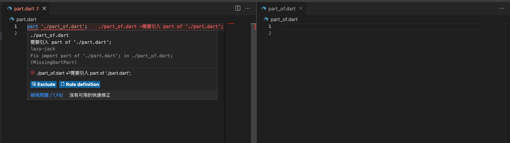

  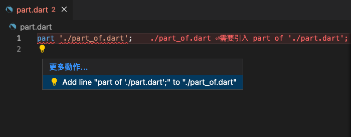

  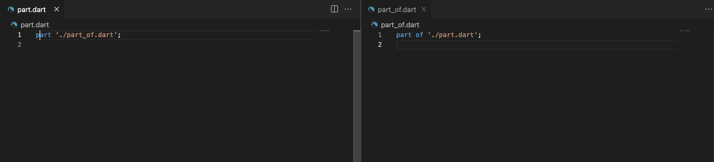

#### SideBar GUI

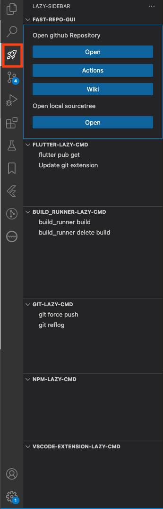


