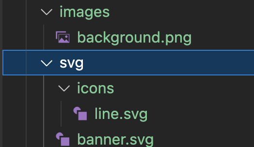

#### Dart Asset Transformer
* Support png
  

* Support svg
  

* Data sample
  

* Transformer path
  


* Svg template
  - Auto check lib support
  
```dart
enum SvgAssets {
  ${svgObj.join(',\n\t')};

  final String path;
  const SvgAssets(this.path);

    Widget toSvgWidget({double? width, double? height, Color? color}) =>
      SvgPicture.asset(
        path,
        width: width,
        height: height,
        colorFilter: color == null
            ? null
            : ColorFilter.mode(
                color,
                BlendMode.srcIn,
        ),
    );
    /// If depends on lib https://pub.dev/packages/vector_graphics 
    Widget withVectorGraphics({
        required String path, 
        double? width,
        double? height,
        Color? color,
        BoxFit fit = BoxFit.contain, 
        Alignment alignment = Alignment.center,
        Clip clipBehavior = Clip.hardEdge,
        String? semanticsLabel, 
    }) =>
        VectorGraphic(
            loader: AssetBytesLoader(path),
            width: width,
            height: height,
            fit: fit,
            alignment: alignment,
            clipBehavior: clipBehavior,
            semanticsLabel: semanticsLabel,
            colorFilter: color == null
                ? null
                : ColorFilter.mode(
                    color,
                    BlendMode.srcIn,
                ),
        );

}


```

* Png template
  
```dart
enum PngImage {
  ${svgObj.join(',\n\t')};

  final String path;
  const PngImage(this.path);
  
  Widget toImage({
    double? width,
    double? height,
    Color? color,
    ImageFrameBuilder? frameBuilder,
    ImageErrorWidgetBuilder? errorBuilder,
    String? semanticLabel,
    bool excludeFromSemantics = false,
    double? scale,
    BlendMode? colorBlendMode,
    BoxFit? fit,
    AlignmentGeometry alignment = Alignment.center,
    ImageRepeat repeat = ImageRepeat.noRepeat,
    Rect? centerSlice,
    bool matchTextDirection = false,
    bool gaplessPlayback = false,
    bool isAntiAlias = false,
    String? package,
    FilterQuality filterQuality = FilterQuality.low,
    int? cacheWidth,
    int? cacheHeight,
  }) =>
      Image.asset(
        path,
        width: width,
        height: height,
        color: color,
        frameBuilder: frameBuilder,
        errorBuilder: errorBuilder,
        semanticLabel: semanticLabel,
        excludeFromSemantics: excludeFromSemantics,
        scale: scale,
        colorBlendMode: colorBlendMode,
        fit: fit,
        alignment: alignment,
        repeat: repeat,
        centerSlice: centerSlice,
        matchTextDirection: matchTextDirection,
        gaplessPlayback: gaplessPlayback,
        isAntiAlias: isAntiAlias,
        package: package,
        filterQuality: filterQuality,
        cacheWidth: cacheWidth,
        cacheHeight: cacheHeight,
      );
}


```