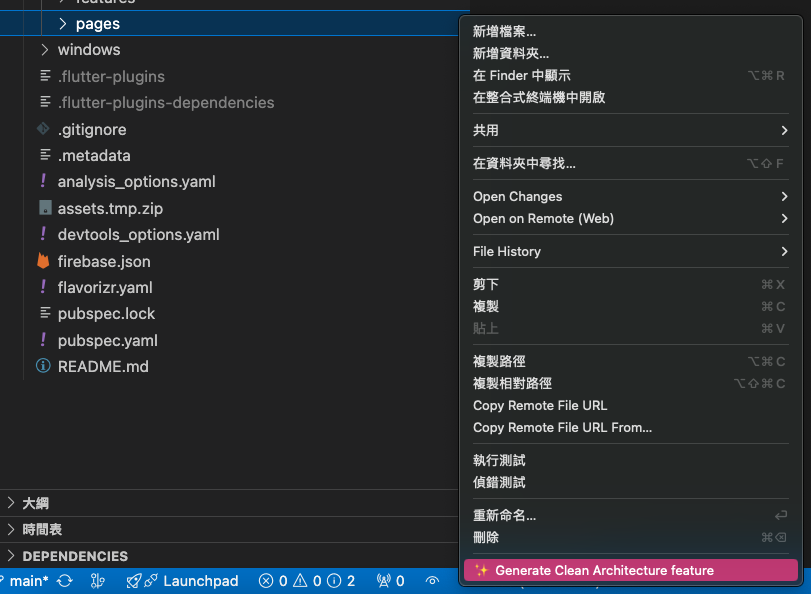
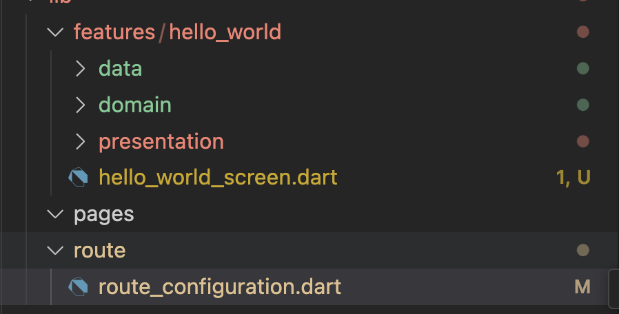
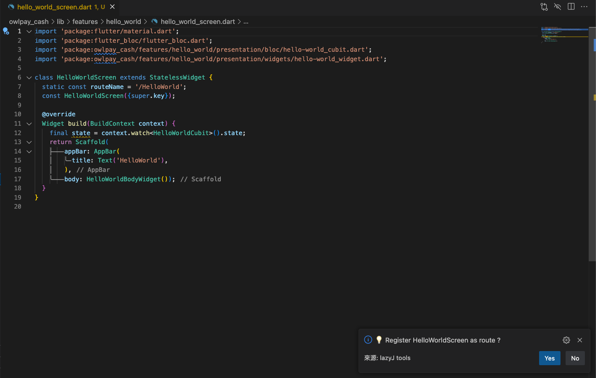

#### Clean architecture with cubit
| Support Fold name  | Image                                           |
|---------------|-------------------------------------------------|
| **features** |     |
| **pages** |     |
| **File tree** |        |

| Feature | Image                                           |
|---------------|-------------------------------------------------|
| **Add cubit** |     |
| **Register Route** |     |

* Auto Route
  - Auto create route/route_configuration.dart
  - Auto register route

```dart

//  Auto-Generated File

// This file is auto-generated by a VSCode extension.

// - [Install Extension](https://marketplace.visualstudio.com/items?itemName=jackFan.lazy-jack)
// - [Read More](https://github.com/jack-fan1991/lazy-jack-flutter-extension/blob/main/doc/clean_architecture.md)


import 'package:flutter/material.dart';
import 'package:flutter/cupertino.dart';
import 'package:owlpay_cash/features/hello_world/hello_world_screen.dart';

// ===== WARNING =====
// Avoid modifying this section to prevent formatting issues.
// ===== WARNING =====

const String ROUTE_HELLO_WORLD = HelloWorldScreen.routeName;

// ===== WARNING =====
// Avoid modifying this section to prevent formatting issues.
// ===== WARNING =====

class RouteConfiguration {
  
  /// ```dart
  /// import 'package:flutter/material.dart';
  /// import 'route_configuration2.dart';

  /// void main() {
  ///   runApp(MyApp());
  /// }

  /// class MyApp extends StatelessWidget {
  ///   @override
  ///   Widget build(BuildContext context) {
  ///     return MaterialApp(
  ///       title: 'My App',
  ///       initialRoute: ROUTE_HOME,
  ///       onGenerateRoute: RouteConfiguration.onGenerateRoute,
  ///     );
  ///   }
  /// }
  ///```
  static Route<dynamic> generateRoute(RouteSettings settings) {
    switch (settings.name) {
      case ROUTE_HELLO_WORLD:
        return CupertinoPageRoute(
          builder: (context) => HelloWorldScreen(),
          settings: RouteSettings(name: settings.name)
        );
      default:
        return CupertinoPageRoute(
          builder: (context) => Scaffold(
            body: Center(
              child: Text('No route defined for '),
            ),
          ),
          settings: RouteSettings(name: settings.name),
        );
    }
  }
}


```