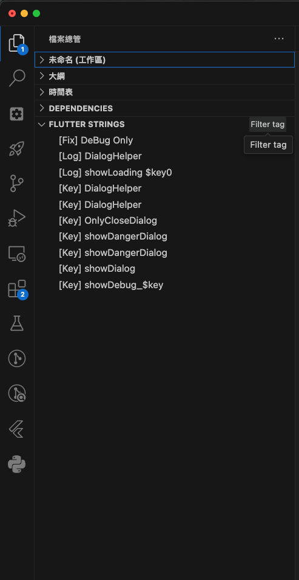
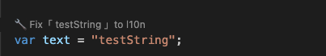

# Flutter l10n Feature Implementation Notes

## Feature Highlights

- **FLUTTER STRINGS:**
  - Displays strings that are not defined as localization (l10n) keys.
  - Supports basic tag-based categorization: `['log' | 'fix' | 'print' | 'other']`.
  - Visible in the sidebar with list-based tag filters.
    
  - Clicking a string automatically navigates to its position in the code. If the tag is `fix`, a quick fix option will be available.
    